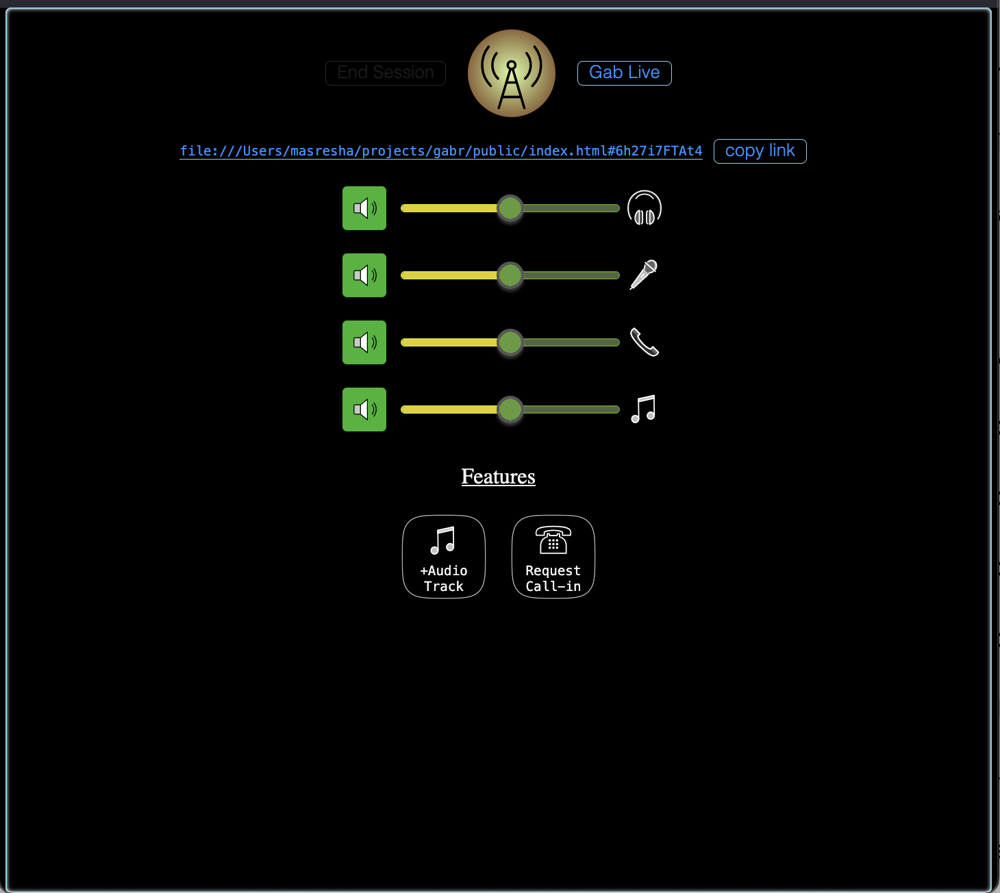

# Live Streaming HIFI audio broadcast over webRTC

## Features
* HIFI opus codec streaming via wasm
* mobile-first, works in mobile safari
* audio controls for streamer
* streamer can add music to the audio
* listeners can call in
* everything over webRTC
* international UI primarily uses icons

## teahcnologies
* webAudio (complex graphs)
* webRTC
* wasm codecs
* node.js, javascript

Requires a signalhub server for making connections

